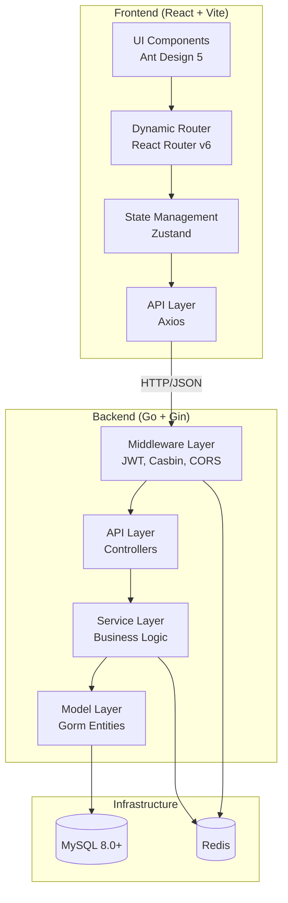

# Design Document: K-Admin System

## Overview

K-Admin is a full-stack admin management system following a clean architecture pattern with clear separation between frontend and backend concerns. The backend uses Go with Gin framework for HTTP routing, Gorm for database operations, and implements a layered architecture (API → Service → Model). The frontend uses React 18 with functional components and hooks, Zustand for state management, and Ant Design 5 for UI components.

The system architecture emphasizes:
- **Modularity**: Clear separation of concerns with domain-driven module organization
- **Security**: Multi-level RBAC with JWT authentication and Casbin authorization
- **Developer Experience**: Visual database tools and code generation for rapid development
- **Type Safety**: TypeScript on frontend, strongly-typed Go on backend
- **Scalability**: Stateless backend design with Redis for distributed caching

## Architecture

### High-Level Architecture



### Backend Architecture Layers

**API Layer (Controllers)**
- Handles HTTP request/response
- Validates input parameters
- Calls service layer methods
- Returns unified response format

**Service Layer**
- Contains business logic
- Orchestrates multiple model operations
- Handles transactions
- Implements permission checks

**Model Layer**
- Defines database entities using Gorm
- Provides basic CRUD operations
- Defines relationships between entities

**Middleware Layer**
- JWT authentication
- Casbin authorization
- CORS handling
- Request logging
- Panic recovery
- Rate limiting

### Frontend Architecture

**Component Hierarchy**
- **Layout Components**: Sidebar, Header, Tabs, Footer
- **Page Components**: Dashboard, System Management, Tools
- **Business Components**: ProTable, AuthButton, ThemeSwitch
- **Base Components**: Ant Design components

**State Management Strategy**
- **useUserStore**: User info, permissions, menu tree
- **useAppStore**: Theme, tabs, global settings
- **Local State**: Component-specific state using useState

**Routing Strategy**
- Static routes: Login, 404, 403
- Dynamic routes: Generated from backend menu tree
- Route guards: Check authentication and permissions


## Components and Interfaces

### Backend Components

#### 1. Unified Response Handler

**Purpose**: Standardize all API responses

**Interface**:
```go
type Response struct {
    Code int         `json:"code"`
    Data interface{} `json:"data"`
    Msg  string      `json:"msg"`
}

func Ok(c *gin.Context, data interface{})
func Fail(c *gin.Context, msg string)
func OkWithDetailed(c *gin.Context, data interface{}, msg string)
func FailWithCode(c *gin.Context, code int, msg string)
```

**Implementation Notes**:
- Code 0 indicates success
- Non-zero codes indicate various error types
- Always returns 200 HTTP status, business logic determines code field
- Middleware can intercept and modify responses

#### 2. JWT Manager

**Purpose**: Handle token generation, validation, and refresh

**Interface**:
```go
type JWTClaims struct {
    UserID   uint   `json:"user_id"`
    Username string `json:"username"`
    RoleID   uint   `json:"role_id"`
    jwt.RegisteredClaims
}

func GenerateToken(userID uint, username string, roleID uint) (accessToken, refreshToken string, err error)
func ParseToken(tokenString string) (*JWTClaims, error)
func RefreshToken(refreshToken string) (newAccessToken string, err error)
func BlacklistToken(token string, expiration time.Duration) error
func IsTokenBlacklisted(token string) bool
```

**Implementation Notes**:
- Access tokens expire in 15 minutes
- Refresh tokens expire in 7 days
- Use Redis for token blacklist with TTL matching token expiration
- Secret keys stored in configuration


#### 3. Casbin Authorization Manager

**Purpose**: Enforce API-level permissions using RBAC policies

**Interface**:
```go
type CasbinManager struct {
    enforcer *casbin.Enforcer
}

func NewCasbinManager(db *gorm.DB) (*CasbinManager, error)
func (cm *CasbinManager) Enforce(role, path, method string) (bool, error)
func (cm *CasbinManager) AddPolicy(role, path, method string) error
func (cm *CasbinManager) RemovePolicy(role, path, method string) error
func (cm *CasbinManager) GetPoliciesForRole(role string) ([][]string, error)
func (cm *CasbinManager) UpdatePoliciesForRole(role string, policies [][]string) error
```

**Casbin Model**:
```ini
[request_definition]
r = sub, obj, act

[policy_definition]
p = sub, obj, act

[role_definition]
g = _, _

[policy_effect]
e = some(where (p.eft == allow))

[matchers]
m = g(r.sub, p.sub) && keyMatch2(r.obj, p.obj) && r.act == p.act
```

**Implementation Notes**:
- Policies stored in sys_casbin_rules table
- Use keyMatch2 for RESTful path matching (/api/v1/user/:id)
- Support role inheritance via g (role_definition)
- Middleware extracts role from JWT claims

#### 4. Menu Service

**Purpose**: Manage menu tree and generate user-specific navigation

**Interface**:
```go
type MenuService struct {
    db *gorm.DB
}

func (s *MenuService) GetMenuTree(roleID uint) ([]MenuNode, error)
func (s *MenuService) CreateMenu(menu *SysMenu) error
func (s *MenuService) UpdateMenu(menu *SysMenu) error
func (s *MenuService) DeleteMenu(id uint) error
func (s *MenuService) GetMenuByID(id uint) (*SysMenu, error)
func (s *MenuService) GetAllMenus() ([]SysMenu, error)
func (s *MenuService) BuildMenuTree(menus []SysMenu) []MenuNode
```

**MenuNode Structure**:
```go
type MenuNode struct {
    ID        uint       `json:"id"`
    ParentID  uint       `json:"parent_id"`
    Path      string     `json:"path"`
    Name      string     `json:"name"`
    Component string     `json:"component"`
    Sort      int        `json:"sort"`
    Meta      MenuMeta   `json:"meta"`
    BtnPerms  []string   `json:"btn_perms"`
    Children  []MenuNode `json:"children"`
}

type MenuMeta struct {
    Icon      string `json:"icon"`
    Title     string `json:"title"`
    Hidden    bool   `json:"hidden"`
    KeepAlive bool   `json:"keep_alive"`
}
```


#### 5. User Service

**Purpose**: Manage user accounts and authentication

**Interface**:
```go
type UserService struct {
    db *gorm.DB
}

func (s *UserService) Login(username, password string) (accessToken, refreshToken string, user *SysUser, err error)
func (s *UserService) CreateUser(user *SysUser) error
func (s *UserService) UpdateUser(user *SysUser) error
func (s *UserService) DeleteUser(id uint) error
func (s *UserService) GetUserByID(id uint) (*SysUser, error)
func (s *UserService) GetUserList(page, pageSize int, filters map[string]interface{}) ([]SysUser, int64, error)
func (s *UserService) ChangePassword(userID uint, oldPassword, newPassword string) error
func (s *UserService) ResetPassword(userID uint, newPassword string) error
func (s *UserService) ToggleUserStatus(userID uint, active bool) error
```

**Implementation Notes**:
- Use bcrypt for password hashing (cost factor 10)
- Validate username uniqueness before creation
- Mask password field in responses
- Support soft delete

#### 6. Role Service

**Purpose**: Manage roles and their permissions

**Interface**:
```go
type RoleService struct {
    db            *gorm.DB
    casbinManager *CasbinManager
}

func (s *RoleService) CreateRole(role *SysRole) error
func (s *RoleService) UpdateRole(role *SysRole) error
func (s *RoleService) DeleteRole(id uint) error
func (s *RoleService) GetRoleByID(id uint) (*SysRole, error)
func (s *RoleService) GetRoleList(page, pageSize int) ([]SysRole, int64, error)
func (s *RoleService) AssignMenus(roleID uint, menuIDs []uint) error
func (s *RoleService) GetRoleMenus(roleID uint) ([]uint, error)
func (s *RoleService) AssignAPIs(roleID uint, policies [][]string) error
func (s *RoleService) GetRoleAPIs(roleID uint) ([][]string, error)
```

**Implementation Notes**:
- Prevent deletion of roles with associated users
- Use transactions when updating role permissions
- Sync Casbin policies when API permissions change


#### 7. Database Inspector Service

**Purpose**: Provide visual database management capabilities

**Interface**:
```go
type DBInspectorService struct {
    db *gorm.DB
}

func (s *DBInspectorService) GetTables() ([]string, error)
func (s *DBInspectorService) GetTableSchema(tableName string) ([]ColumnInfo, error)
func (s *DBInspectorService) GetTableData(tableName string, page, pageSize int) ([]map[string]interface{}, int64, error)
func (s *DBInspectorService) ExecuteSQL(sql string, readOnly bool) (interface{}, error)
func (s *DBInspectorService) CreateRecord(tableName string, data map[string]interface{}) error
func (s *DBInspectorService) UpdateRecord(tableName string, id interface{}, data map[string]interface{}) error
func (s *DBInspectorService) DeleteRecord(tableName string, id interface{}) error
func (s *DBInspectorService) ValidateSQL(sql string) error
```

**ColumnInfo Structure**:
```go
type ColumnInfo struct {
    Name       string `json:"name"`
    Type       string `json:"type"`
    Nullable   bool   `json:"nullable"`
    Key        string `json:"key"`
    Default    string `json:"default"`
    Extra      string `json:"extra"`
    Comment    string `json:"comment"`
}
```

**Security Considerations**:
- Whitelist safe SQL commands for read-only mode
- Blacklist dangerous commands: DROP, TRUNCATE, ALTER (unless super admin)
- Require password confirmation for destructive operations
- Log all SQL executions with user information

#### 8. Code Generator Service

**Purpose**: Generate CRUD code from database table schemas

**Interface**:
```go
type CodeGeneratorService struct {
    db *gorm.DB
}

type GenerateConfig struct {
    TableName    string            `json:"table_name"`
    StructName   string            `json:"struct_name"`
    PackageName  string            `json:"package_name"`
    FrontendPath string            `json:"frontend_path"`
    Fields       []FieldConfig     `json:"fields"`
    Options      GenerateOptions   `json:"options"`
}

type FieldConfig struct {
    ColumnName string `json:"column_name"`
    FieldName  string `json:"field_name"`
    FieldType  string `json:"field_type"`
    JSONTag    string `json:"json_tag"`
    GormTag    string `json:"gorm_tag"`
    Comment    string `json:"comment"`
}

type GenerateOptions struct {
    GenerateModel      bool `json:"generate_model"`
    GenerateService    bool `json:"generate_service"`
    GenerateAPI        bool `json:"generate_api"`
    GenerateRouter     bool `json:"generate_router"`
    GenerateFrontendAPI bool `json:"generate_frontend_api"`
    GenerateFrontendTypes bool `json:"generate_frontend_types"`
    GenerateFrontendPage bool `json:"generate_frontend_page"`
}

func (s *CodeGeneratorService) GetTableMetadata(tableName string) (*TableMetadata, error)
func (s *CodeGeneratorService) GenerateCode(config GenerateConfig) (map[string]string, error)
func (s *CodeGeneratorService) PreviewCode(config GenerateConfig) (map[string]string, error)
func (s *CodeGeneratorService) WriteGeneratedCode(files map[string]string) error
func (s *CodeGeneratorService) CreateTable(tableName string, fields []FieldConfig) error
```

**Template Files**:
- `backend/model.tpl`: Gorm model struct
- `backend/service.tpl`: Service layer with CRUD methods
- `backend/api.tpl`: Gin controller handlers
- `backend/router.tpl`: Router registration
- `frontend/api.tpl`: Axios API definitions
- `frontend/types.tpl`: TypeScript interfaces
- `frontend/page.tpl`: Table page component
- `frontend/modal.tpl`: Form modal component


### Frontend Components

#### 1. API Request Module

**Purpose**: Centralized HTTP client with interceptors

**Interface**:
```typescript
interface UnifiedResponse<T = any> {
  code: number;
  data: T;
  msg: string;
}

class RequestClient {
  private axiosInstance: AxiosInstance;
  
  constructor(config: AxiosRequestConfig);
  get<T>(url: string, config?: AxiosRequestConfig): Promise<T>;
  post<T>(url: string, data?: any, config?: AxiosRequestConfig): Promise<T>;
  put<T>(url: string, data?: any, config?: AxiosRequestConfig): Promise<T>;
  delete<T>(url: string, config?: AxiosRequestConfig): Promise<T>;
}

// Request interceptor: Add Authorization header
// Response interceptor: Handle token refresh, extract data field, show error messages
```

**Token Refresh Logic**:
1. Request fails with 401 status
2. Check if refresh is already in progress (prevent multiple refresh calls)
3. Call refresh token API
4. Update stored access token
5. Retry original request with new token
6. If refresh fails, redirect to login

#### 2. Dynamic Router Generator

**Purpose**: Convert backend menu tree to React Router configuration

**Interface**:
```typescript
interface MenuItem {
  id: number;
  parent_id: number;
  path: string;
  name: string;
  component: string;
  sort: number;
  meta: MenuMeta;
  btn_perms: string[];
  children?: MenuItem[];
}

interface MenuMeta {
  icon: string;
  title: string;
  hidden: boolean;
  keep_alive: boolean;
}

function generateRoutes(menuTree: MenuItem[]): RouteObject[];
function loadComponent(componentPath: string): LazyExoticComponent<ComponentType<any>>;
```

**Implementation Strategy**:
- Use React.lazy for dynamic component imports
- Map component paths to actual file paths (e.g., "views/system/user/index" → "@/views/system/user/index.tsx")
- Wrap lazy components with Suspense and loading fallback
- Generate nested routes matching menu hierarchy


#### 3. User Store (Zustand)

**Purpose**: Manage user authentication state and permissions

**Interface**:
```typescript
interface UserState {
  userInfo: UserInfo | null;
  accessToken: string;
  refreshToken: string;
  permissions: string[];
  menuTree: MenuItem[];
  
  // Actions
  login: (username: string, password: string) => Promise<void>;
  logout: () => void;
  refreshAccessToken: () => Promise<void>;
  fetchUserMenu: () => Promise<void>;
  hasPermission: (perm: string) => boolean;
  updateUserInfo: (info: Partial<UserInfo>) => void;
}

const useUserStore = create<UserState>()(
  persist(
    (set, get) => ({
      // Implementation
    }),
    {
      name: 'user-storage',
      partialize: (state) => ({
        accessToken: state.accessToken,
        refreshToken: state.refreshToken,
        userInfo: state.userInfo,
      }),
    }
  )
);
```

#### 4. App Store (Zustand)

**Purpose**: Manage global application state

**Interface**:
```typescript
interface TabItem {
  key: string;
  label: string;
  path: string;
  closable: boolean;
}

interface AppState {
  theme: 'light' | 'dark';
  collapsed: boolean;
  tabs: TabItem[];
  activeTab: string;
  
  // Actions
  toggleTheme: () => void;
  toggleSidebar: () => void;
  addTab: (tab: TabItem) => void;
  removeTab: (key: string) => void;
  setActiveTab: (key: string) => void;
  clearTabs: () => void;
}

const useAppStore = create<AppState>()(
  persist(
    (set, get) => ({
      // Implementation
    }),
    {
      name: 'app-storage',
    }
  )
);
```

#### 5. AuthButton Component

**Purpose**: Conditionally render buttons based on permissions

**Interface**:
```typescript
interface AuthButtonProps extends ButtonProps {
  perm: string;
  fallback?: ReactNode;
}

function AuthButton({ perm, fallback, children, ...props }: AuthButtonProps): ReactElement | null;
```

**Implementation**:
- Use useUserStore to access permissions array
- Check if perm exists in user's permissions
- Render button if authorized, fallback if provided, or null

#### 6. ProTable Component

**Purpose**: Enhanced table with integrated search, pagination, and actions

**Interface**:
```typescript
interface ProTableProps<T> {
  columns: ProColumnType<T>[];
  request: (params: RequestParams) => Promise<{ data: T[]; total: number }>;
  toolBarRender?: () => ReactNode[];
  rowKey: string | ((record: T) => string);
  searchConfig?: SearchConfig;
  actionRef?: MutableRefObject<ActionType | undefined>;
}

interface ActionType {
  reload: () => void;
  reset: () => void;
}

function ProTable<T extends Record<string, any>>(props: ProTableProps<T>): ReactElement;
```

**Features**:
- Automatic loading state management
- Integrated search form with configurable fields
- Pagination with page size selector
- Refresh and reset buttons
- Export action support


#### 7. Keep-Alive Tabs System

**Purpose**: Preserve component state when switching between pages

**Implementation Strategy**:
- Use React Router's route name as cache key
- Store component instances in a Map
- Use CSS display:none to hide inactive tabs instead of unmounting
- Provide refresh action to force remount specific tab

**Component Structure**:
```typescript
interface KeepAliveProps {
  children: ReactNode;
  cacheKey: string;
  active: boolean;
}

function KeepAlive({ children, cacheKey, active }: KeepAliveProps): ReactElement;

// Usage in Layout
function TabsLayout() {
  const { tabs, activeTab } = useAppStore();
  
  return (
    <div>
      <Tabs items={tabs} activeKey={activeTab} />
      {tabs.map(tab => (
        <KeepAlive key={tab.key} cacheKey={tab.key} active={tab.key === activeTab}>
          <Outlet />
        </KeepAlive>
      ))}
    </div>
  );
}
```

## Data Models

### Backend Models (Go + Gorm)

#### Base Model

```go
type BaseModel struct {
    ID        uint           `gorm:"primarykey" json:"id"`
    CreatedAt time.Time      `json:"created_at"`
    UpdatedAt time.Time      `json:"updated_at"`
    DeletedAt gorm.DeletedAt `gorm:"index" json:"-"`
}
```

#### SysUser

```go
type SysUser struct {
    BaseModel
    Username  string `gorm:"type:varchar(50);uniqueIndex;not null" json:"username"`
    Password  string `gorm:"type:varchar(255);not null" json:"-"`
    Nickname  string `gorm:"type:varchar(50)" json:"nickname"`
    HeaderImg string `gorm:"type:varchar(255)" json:"header_img"`
    Phone     string `gorm:"type:varchar(20)" json:"phone"`
    Email     string `gorm:"type:varchar(100)" json:"email"`
    RoleID    uint   `gorm:"not null" json:"role_id"`
    Active    bool   `gorm:"default:true" json:"active"`
    
    Role      SysRole `gorm:"foreignKey:RoleID" json:"role"`
}
```

#### SysRole

```go
type SysRole struct {
    BaseModel
    RoleName  string `gorm:"type:varchar(50);not null" json:"role_name"`
    RoleKey   string `gorm:"type:varchar(50);uniqueIndex;not null" json:"role_key"`
    DataScope string `gorm:"type:varchar(20);default:'all'" json:"data_scope"`
    Sort      int    `gorm:"default:0" json:"sort"`
    Status    bool   `gorm:"default:true" json:"status"`
    Remark    string `gorm:"type:varchar(255)" json:"remark"`
    
    Users     []SysUser `gorm:"foreignKey:RoleID" json:"-"`
    Menus     []SysMenu `gorm:"many2many:sys_role_menus;" json:"-"`
}
```

#### SysMenu

```go
type SysMenu struct {
    BaseModel
    ParentID  uint   `gorm:"default:0" json:"parent_id"`
    Path      string `gorm:"type:varchar(100)" json:"path"`
    Name      string `gorm:"type:varchar(50)" json:"name"`
    Component string `gorm:"type:varchar(100)" json:"component"`
    Sort      int    `gorm:"default:0" json:"sort"`
    Meta      string `gorm:"type:json" json:"meta"`
    BtnPerms  string `gorm:"type:json" json:"btn_perms"`
    
    Children  []SysMenu `gorm:"-" json:"children,omitempty"`
    Roles     []SysRole `gorm:"many2many:sys_role_menus;" json:"-"`
}
```

#### SysCasbinRule

```go
type SysCasbinRule struct {
    ID    uint   `gorm:"primarykey;autoIncrement"`
    Ptype string `gorm:"size:100;uniqueIndex:unique_index"`
    V0    string `gorm:"size:100;uniqueIndex:unique_index"`
    V1    string `gorm:"size:100;uniqueIndex:unique_index"`
    V2    string `gorm:"size:100;uniqueIndex:unique_index"`
    V3    string `gorm:"size:100;uniqueIndex:unique_index"`
    V4    string `gorm:"size:100;uniqueIndex:unique_index"`
    V5    string `gorm:"size:100;uniqueIndex:unique_index"`
}
```

### Frontend Models (TypeScript)

#### User Types

```typescript
interface UserInfo {
  id: number;
  username: string;
  nickname: string;
  header_img: string;
  phone: string;
  email: string;
  role_id: number;
  active: boolean;
  role: RoleInfo;
  created_at: string;
  updated_at: string;
}

interface LoginRequest {
  username: string;
  password: string;
}

interface LoginResponse {
  access_token: string;
  refresh_token: string;
  user: UserInfo;
}
```

#### Role Types

```typescript
interface RoleInfo {
  id: number;
  role_name: string;
  role_key: string;
  data_scope: string;
  sort: number;
  status: boolean;
  remark: string;
  created_at: string;
  updated_at: string;
}

interface RoleFormData {
  role_name: string;
  role_key: string;
  data_scope: string;
  sort: number;
  status: boolean;
  remark: string;
  menu_ids: number[];
}
```

#### Menu Types

```typescript
interface MenuInfo {
  id: number;
  parent_id: number;
  path: string;
  name: string;
  component: string;
  sort: number;
  meta: MenuMeta;
  btn_perms: string[];
  children?: MenuInfo[];
}

interface MenuFormData {
  parent_id: number;
  path: string;
  name: string;
  component: string;
  sort: number;
  meta: {
    icon: string;
    title: string;
    hidden: boolean;
    keep_alive: boolean;
  };
  btn_perms: string[];
}
```


## Correctness Properties

A property is a characteristic or behavior that should hold true across all valid executions of a system—essentially, a formal statement about what the system should do. Properties serve as the bridge between human-readable specifications and machine-verifiable correctness guarantees.

### Backend Properties

Property 1: Unified Response Structure
*For any* API endpoint response, the JSON structure SHALL contain exactly three fields: code (integer), data (object), and msg (string), where code equals 0 for success and non-zero for errors
**Validates: Requirements 1.1, 1.2, 1.3**

Property 2: Password Encryption Round-Trip
*For any* password string, encrypting with bcrypt and then validating against the hash SHALL return true for the original password and false for any different password
**Validates: Requirements 2.2**

Property 3: Token Generation and Refresh Cycle
*For any* valid user credentials, login SHALL generate both access and refresh tokens, and using the refresh token SHALL produce a new valid access token
**Validates: Requirements 2.1, 2.5**

Property 4: Token Blacklist Enforcement
*For any* blacklisted token, all API requests using that token SHALL be rejected with 401 status regardless of token validity
**Validates: Requirements 2.7**

Property 5: Menu Tree Authorization Filtering
*For any* user with specific role permissions, the returned menu tree SHALL contain only menus assigned to that role and exclude all unauthorized menus
**Validates: Requirements 3.2**

Property 6: Route Generation from Menu Tree
*For any* menu tree structure, the generated React Router configuration SHALL have routes matching all menu paths with correct nesting hierarchy
**Validates: Requirements 3.3, 9.2, 9.7**

Property 7: API Authorization Enforcement
*For any* API request without proper Casbin policy permission, the backend SHALL return 403 Forbidden status
**Validates: Requirements 3.7**

Property 8: Role Permission Inheritance
*For any* child role with parent role relationship, the child role SHALL have all permissions of the parent role plus its own permissions
**Validates: Requirements 3.8**

Property 9: User CRUD Consistency
*For any* user creation, the created user SHALL be retrievable by ID, updatable with new values, and deletable (soft delete) such that it no longer appears in active user queries
**Validates: Requirements 4.2, 4.3, 4.4, 4.5**

Property 10: Password Field Masking
*For any* API response containing user data, the password field SHALL never be included in the JSON output
**Validates: Requirements 4.7**

Property 11: Username Uniqueness Validation
*For any* attempt to create a user with an existing username, the system SHALL reject the creation and return a validation error
**Validates: Requirements 4.8**

Property 12: User List Pagination and Filtering
*For any* user list request with pagination parameters (page, pageSize) and filters, the response SHALL contain exactly pageSize or fewer users matching the filters, and the total count SHALL equal the number of matching users
**Validates: Requirements 4.6**

Property 13: Role Deletion Protection
*For any* role that has associated users, deletion attempts SHALL fail with an error indicating the role is in use
**Validates: Requirements 5.6**

Property 14: Role Permission Assignment
*For any* role with assigned menu IDs, querying the role's menus SHALL return exactly those menu IDs, and users with that role SHALL have access to those menus
**Validates: Requirements 5.3, 5.4**

Property 15: Menu Hierarchy Preservation
*For any* menu tree with nested structure, all parent-child relationships SHALL be preserved when retrieving menus, and children SHALL be sorted by the sort field
**Validates: Requirements 6.2, 6.6**

Property 16: Menu Metadata Serialization Round-Trip
*For any* menu with metadata (icon, title, hidden, keepAlive), storing to database and retrieving SHALL produce equivalent metadata values
**Validates: Requirements 6.3**

Property 17: Hidden Menu Route Accessibility
*For any* menu with hidden=true in metadata, the menu SHALL not appear in sidebar navigation but its route SHALL remain accessible via direct URL
**Validates: Requirements 6.8**

Property 18: Database Table Listing Completeness
*For any* connected database, the DB Inspector SHALL return all tables that exist in the database schema
**Validates: Requirements 7.2**

Property 19: Table Schema Accuracy
*For any* selected table, the displayed schema SHALL include all columns with accurate types, nullability, keys, and comments matching the actual database schema
**Validates: Requirements 7.3**

Property 20: DB Inspector CRUD Operations
*For any* table record, creating a record SHALL make it retrievable, updating SHALL persist changes, and deleting SHALL remove it from subsequent queries
**Validates: Requirements 7.4, 7.5**

Property 21: Dangerous SQL Operation Restriction
*For any* user without super admin privileges, attempts to execute DROP, TRUNCATE, or ALTER commands SHALL be rejected with permission error
**Validates: Requirements 7.7**

Property 22: Read-Only Mode Enforcement
*For any* write operation (INSERT, UPDATE, DELETE) attempted in read-only mode, the operation SHALL fail with a read-only mode error
**Validates: Requirements 7.8**

Property 23: SQL Error Message Propagation
*For any* SQL execution that fails, the error response SHALL contain the database error message with sufficient detail for debugging
**Validates: Requirements 7.9**

Property 24: Code Generator Metadata Extraction
*For any* database table, the extracted metadata SHALL include all columns with their names, types, and constraints matching the actual table structure
**Validates: Requirements 8.2**

Property 25: Backend Code Generation Completeness
*For any* table with generation config, the code generator SHALL produce all four backend files: model, service, API controller, and router registration
**Validates: Requirements 8.4**

Property 26: Frontend Code Generation Completeness
*For any* table with generation config, the code generator SHALL produce all four frontend files: TypeScript types, API definitions, table page, and form modal
**Validates: Requirements 8.5**

Property 27: Code Preview Without Side Effects
*For any* code generation preview request, code SHALL be generated and returned without writing any files to disk
**Validates: Requirements 8.8**

Property 28: Automatic Table Creation
*For any* field definition array, creating a table SHALL result in a database table with columns matching the field definitions
**Validates: Requirements 8.9**

Property 29: Theme Preference Persistence
*For any* theme selection (light or dark), the preference SHALL be saved to localStorage and restored on next application load
**Validates: Requirements 10.2**

Property 30: Tab State Preservation
*For any* component with Keep-Alive enabled, switching away and back to the tab SHALL restore form inputs, scroll position, and component state
**Validates: Requirements 10.3, 10.4, 10.5**

Property 31: Tab Management Operations
*For any* open tab, closing it SHALL remove it from the tab list, and closing all except current SHALL leave only the active tab
**Validates: Requirements 10.6, 10.7**

Property 32: Authorization Header Injection
*For any* API request made through the request client, the Authorization header SHALL be automatically attached with the current access token
**Validates: Requirements 11.2**

Property 33: Response Data Extraction
*For any* successful API response (code=0), the request client SHALL extract and return only the data field, hiding the wrapper structure
**Validates: Requirements 11.3**

Property 34: Error Notification Display
*For any* failed API response (code≠0), the request client SHALL display the msg field as a user-visible error notification
**Validates: Requirements 11.4**

Property 35: Automatic Token Refresh on 401
*For any* API request that returns 401 status, the request client SHALL automatically attempt token refresh and retry the original request once
**Validates: Requirements 11.5**

Property 36: Panic Recovery Without Crash
*For any* request handler that panics, the panic recovery middleware SHALL catch the panic, log it, return 500 error, and keep the server running
**Validates: Requirements 11.7, 16.6**

Property 37: Error Logging with Stack Traces
*For any* error that occurs in the backend, the error SHALL be logged with timestamp, error message, and full stack trace
**Validates: Requirements 11.8**

Property 38: Configuration Source Priority
*For any* configuration key defined in multiple sources (YAML, JSON, environment variables), the environment variable value SHALL take precedence
**Validates: Requirements 12.2**

Property 39: Configuration Validation on Startup
*For any* missing required configuration field, the backend SHALL fail to start and log a detailed error message indicating which field is missing
**Validates: Requirements 12.4, 12.5**

Property 40: Log Level Filtering
*For any* configured log level, only log messages at that level or higher severity SHALL be output
**Validates: Requirements 13.3**

Property 41: HTTP Request Logging Completeness
*For any* HTTP request, the log entry SHALL contain timestamp, method, path, status code, latency, and client IP
**Validates: Requirements 13.4**

Property 42: Debug Mode Query Logging
*For any* database query executed in debug mode, the query SQL and execution time SHALL be logged
**Validates: Requirements 13.5**

Property 43: Environment-Specific Log Output
*For any* backend running in development mode, logs SHALL output to both console and file; in production mode, logs SHALL output to file only
**Validates: Requirements 13.7, 13.8**

Property 44: Database Connection Pool Management
*For any* database connection pool configuration, the number of active connections SHALL never exceed the configured maximum
**Validates: Requirements 15.3**

Property 45: Automatic Database Reconnection
*For any* database connection loss, the backend SHALL automatically attempt reconnection and restore functionality without manual intervention
**Validates: Requirements 15.4**

Property 46: Database Migration Execution
*For any* model struct with Gorm tags, running AutoMigrate SHALL create or update the corresponding database table to match the struct definition
**Validates: Requirements 15.5**

Property 47: Soft Delete Behavior
*For any* record with DeletedAt field, deleting the record SHALL set DeletedAt to current timestamp, and subsequent queries SHALL exclude soft-deleted records by default
**Validates: Requirements 15.7**

Property 48: Slow Query Logging
*For any* database query exceeding the configured threshold (default 200ms), the query SHALL be logged with execution time
**Validates: Requirements 15.8**

Property 49: JWT Middleware Token Validation
*For any* protected endpoint request with invalid or expired access token, the JWT middleware SHALL reject the request with 401 status
**Validates: Requirements 16.1**

Property 50: Casbin Middleware Authorization
*For any* API request, the Casbin middleware SHALL check the user's role against policies and block requests without matching policy
**Validates: Requirements 16.2**

Property 51: CORS Header Configuration
*For any* cross-origin request from an allowed origin, the CORS middleware SHALL set appropriate Access-Control headers
**Validates: Requirements 16.3**

Property 52: Rate Limiting Enforcement
*For any* client exceeding the configured request rate limit, subsequent requests SHALL be rejected with 429 Too Many Requests status
**Validates: Requirements 16.4**

Property 53: Middleware Execution Order
*For any* request, middleware SHALL execute in the defined order: CORS → Rate Limit → JWT → Casbin → Handler → Recovery
**Validates: Requirements 16.7**

Property 54: Middleware Route Exclusion
*For any* route marked as excluded from specific middleware, that middleware SHALL not execute for requests to that route
**Validates: Requirements 16.8**

### Frontend Properties

Property 55: AuthButton Permission Visibility
*For any* AuthButton component with permission requirement, the button SHALL render only if the user's permissions array contains that permission
**Validates: Requirements 3.6**

Property 56: Dynamic Component Loading
*For any* menu item with component path, the frontend SHALL dynamically import and render the component at that path when the route is accessed
**Validates: Requirements 6.7, 9.3**

Property 57: Sidebar Navigation Rendering
*For any* menu tree, the sidebar SHALL render menu items in hierarchical structure matching the tree, with proper nesting and sorting
**Validates: Requirements 6.5, 9.5**

Property 58: Loading State Automation
*For any* API request initiated through the request client, loading state SHALL automatically be set to true at start and false at completion
**Validates: Requirements 11.6**

Property 59: React Error Boundary Catching
*For any* React component rendering error, the Error Boundary SHALL catch the error, display fallback UI, and prevent application crash
**Validates: Requirements 11.9**


## Error Handling

### Backend Error Handling Strategy

**Panic Recovery**
- All routes wrapped with recovery middleware
- Panics caught and logged with stack traces
- 500 Internal Server Error returned to client
- Server continues running after panic

**Validation Errors**
- Input validation at API layer using validator library
- Return 400 Bad Request with detailed field errors
- Use unified response format with error messages

**Business Logic Errors**
- Service layer returns custom error types
- API layer translates to appropriate HTTP status codes
- Common errors: NotFound (404), Forbidden (403), Conflict (409)

**Database Errors**
- Gorm errors caught and logged
- Generic error messages returned to client (avoid exposing schema details)
- Specific handling for: duplicate key, foreign key constraint, connection errors

**Authentication/Authorization Errors**
- JWT validation failures return 401 Unauthorized
- Casbin policy violations return 403 Forbidden
- Token refresh failures redirect to login

**External Service Errors**
- Redis connection failures logged but don't crash server
- Graceful degradation when possible (e.g., skip caching)
- Retry logic with exponential backoff for transient failures

### Frontend Error Handling Strategy

**API Request Errors**
- Axios interceptor catches all HTTP errors
- Display user-friendly error messages via Ant Design notification
- Log detailed errors to console in development mode
- Automatic retry for network errors (configurable)

**React Rendering Errors**
- Error Boundary components at strategic levels (route level, layout level)
- Fallback UI with error message and reload button
- Errors logged to error tracking service (e.g., Sentry)

**Form Validation Errors**
- Client-side validation using Ant Design Form rules
- Real-time validation feedback
- Prevent submission until all validations pass

**Route Navigation Errors**
- 404 page for non-existent routes
- 403 page for unauthorized routes
- Automatic redirect to login for unauthenticated access

**State Management Errors**
- Zustand store actions wrapped in try-catch
- Failed state updates logged and notified to user
- State rollback on critical failures


## Testing Strategy

### Dual Testing Approach

The K-Admin system requires both unit tests and property-based tests for comprehensive coverage:

- **Unit tests**: Verify specific examples, edge cases, and error conditions
- **Property tests**: Verify universal properties across all inputs

Both testing approaches are complementary and necessary. Unit tests catch concrete bugs in specific scenarios, while property tests verify general correctness across a wide range of inputs.

### Backend Testing

**Property-Based Testing Library**: Use `gopter` for Go property-based testing

**Property Test Configuration**:
- Minimum 100 iterations per property test
- Each test tagged with: `Feature: k-admin-system, Property {number}: {property_text}`
- Each correctness property implemented by a SINGLE property-based test

**Unit Testing Focus**:
- Specific examples demonstrating correct behavior
- Edge cases: empty inputs, boundary values, special characters
- Error conditions: invalid tokens, missing permissions, database errors
- Integration points: middleware chains, service layer interactions

**Test Organization**:
```
backend/
  api/v1/system/
    user_test.go          # Unit tests for user API
    user_property_test.go # Property tests for user operations
  service/
    user_service_test.go  # Unit tests for user service
  middleware/
    jwt_test.go           # Unit tests for JWT middleware
    casbin_test.go        # Unit tests for Casbin middleware
```

**Key Property Tests**:
- Property 1: Unified response structure (test all endpoints)
- Property 2: Password encryption round-trip
- Property 3: Token generation and refresh cycle
- Property 9: User CRUD consistency
- Property 15: Menu hierarchy preservation
- Property 20: DB Inspector CRUD operations
- Property 25-26: Code generation completeness
- Property 36: Panic recovery without crash
- Property 47: Soft delete behavior

**Unit Test Examples**:
- Login with valid credentials returns tokens
- Login with invalid credentials returns 401
- Creating user with duplicate username returns error
- Deleting role with users returns error
- JWT middleware rejects expired tokens
- Casbin middleware blocks unauthorized API calls

### Frontend Testing

**Property-Based Testing Library**: Use `fast-check` for TypeScript property-based testing

**Testing Framework**: Vitest + React Testing Library

**Property Test Configuration**:
- Minimum 100 iterations per property test
- Each test tagged with: `Feature: k-admin-system, Property {number}: {property_text}`

**Unit Testing Focus**:
- Component rendering with various props
- User interactions: clicks, form inputs, navigation
- State management: store actions and selectors
- API integration: mocked responses, error handling
- Route guards: authentication and authorization checks

**Test Organization**:
```
frontend/
  src/
    components/
      AuthButton.test.tsx
      ProTable.test.tsx
    hooks/
      useAuth.test.ts
    store/
      userStore.test.ts
      appStore.test.ts
    utils/
      request.test.ts
      request.property.test.ts
```

**Key Property Tests**:
- Property 29: Theme preference persistence
- Property 30: Tab state preservation
- Property 32: Authorization header injection
- Property 33: Response data extraction
- Property 35: Automatic token refresh on 401
- Property 55: AuthButton permission visibility
- Property 56: Dynamic component loading
- Property 58: Loading state automation

**Unit Test Examples**:
- AuthButton renders when user has permission
- AuthButton hidden when user lacks permission
- Login form submits and stores tokens
- Token refresh triggered on 401 response
- Menu tree converted to route configuration
- Tabs added when navigating to new pages
- Theme toggle switches between light and dark

### Integration Testing

**Backend Integration Tests**:
- Full request/response cycle through middleware stack
- Database operations with test database
- JWT token generation and validation flow
- Casbin policy enforcement across multiple endpoints
- Code generator end-to-end: table → generated files

**Frontend Integration Tests**:
- Complete user flows: login → navigate → CRUD operations
- Dynamic routing: menu fetch → route generation → navigation
- Token refresh: expired token → auto refresh → request retry
- Tab system: navigate → switch tabs → state preserved

### Test Data Management

**Backend**:
- Use test database separate from development database
- Database migrations run before tests
- Test fixtures for common data: users, roles, menus
- Cleanup after each test to ensure isolation

**Frontend**:
- Mock API responses using MSW (Mock Service Worker)
- Test fixtures for user data, menu trees, permissions
- LocalStorage mocked and cleared between tests

### Continuous Integration

**CI Pipeline**:
1. Run linters (golangci-lint, ESLint)
2. Run unit tests with coverage reporting
3. Run property tests (100 iterations minimum)
4. Run integration tests
5. Build Docker images
6. Deploy to staging environment

**Coverage Goals**:
- Backend: 80% code coverage minimum
- Frontend: 75% code coverage minimum
- All correctness properties must have passing property tests
